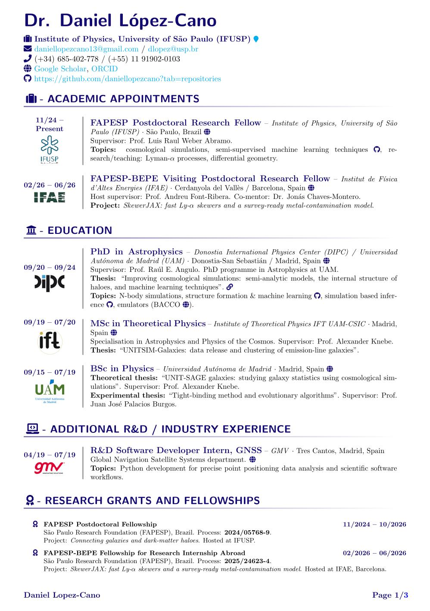

::: {.cv-doc-wrap}
::: {.doc-card .cv-doc-card}
[{.doc-thumb .cv-doc-thumb fig-alt="Preview of CV PDF"}](assets/files/DLC_CV.pdf)

::: {.doc-body}
### Daniel López-Cano — CV

::: {.media-actions}
[Download PDF](assets/files/DLC_CV.pdf){.btn .btn-primary .btn-sm}
:::
:::
:::
:::