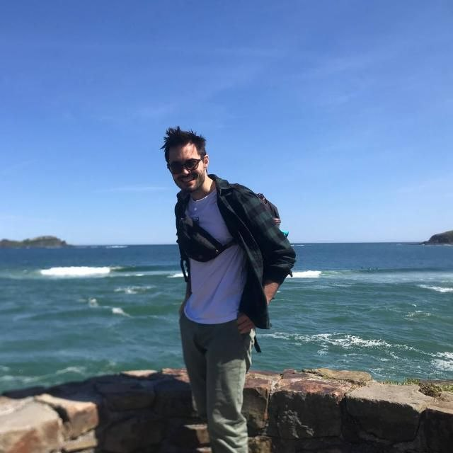
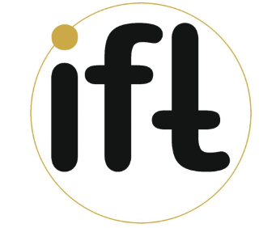
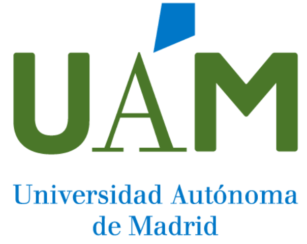

::: {.home-landing}

{.home-photo fig-alt="Portrait of Daniel López Cano"}

::: {.home-name}
Daniel López Cano
:::

::: {.home-role}
Postdoctoral Researcher in Computational Cosmology
:::

::: {.home-summary}
[Institute of Physics, University of São Paulo (IFUSP)](https://portal.if.usp.br/ifusp/pt-br/users/dlopez) · São Paulo, Brazil  

[daniellopezcano13@gmail.com](mailto:daniellopezcano13@gmail.com)
:::

:::

## Research interests

::: {.minimal-panel}
Computational cosmology · machine learning for astrophysics · cosmological simulations · Ly$\alpha$ forest and absorption processes · galaxy–halo connection · simulation-to-observation transfer · pedagogical resources for theoretical physics and astrophysics
:::

## About

Hello! I am a postdoctoral researcher in computational cosmology at the Institute of Physics of the University of São Paulo (IFUSP). My work brings together cosmological simulations, machine learning for astrophysics, survey-oriented modelling, and scientific software development. More recently, I have also been working on Ly$\alpha$ absorption processes, fast skewer generation, and pedagogical resources that use computational tools to support the learning of theoretical physics and astrophysics.

I am currently a FAPESP Postdoctoral Fellow at IFUSP, and in 2026 I am also undertaking a FAPESP-BEPE visiting research stay at the Institut de Física d'Altes Energies (IFAE) in Barcelona. Before moving to São Paulo, I completed my PhD in Astrophysics at the Donostia International Physics Center (DIPC) after completing my BSc in physics and MSc in theoretical physics at the Autonomous University of Madrid (UAM) / Institute of Theoretical Physics (IFT). Across these stages, I developed a broad interest in combining theoretical ideas, numerical methods, and data-driven techniques to study complex problems in cosmology and astrophysics.

## Trajectory

::: {.trajectory-entry}
[{.trajectory-logo fig-alt="IFUSP logo"}](https://portal.if.usp.br/ifusp/pt-br/users/dlopez)

::: {.trajectory-body}
### FAPESP Postdoctoral Research Fellow

**Institute of Physics, University of São Paulo (IFUSP)** · São Paulo, Brazil -- **11/2024 – Present**

Supervisor: Prof. Dr. Luis Raul Weber Abramo.

::: {.media-actions}
[IFUSP profile](https://portal.if.usp.br/ifusp/pt-br/users/dlopez){.btn .btn-outline-info .btn-sm}
:::
:::
:::

::: {.trajectory-entry}
[{.trajectory-logo fig-alt="IFAE logo"}](https://bv.fapesp.br/en/pesquisador/735607/daniel-lopez-cano/)

::: {.trajectory-body}
### FAPESP-BEPE Visiting Postdoctoral Research Fellow

**Institut de Física d'Altes Energies (IFAE)** · Barcelona area, Spain  -- **02/2026 – 06/2026**

Host supervisor: Prof. Dr. Andreu Font-Ribera. Co-mentor: Dr. Jonás Chaves-Montero.

::: {.media-actions}
[FAPESP researcher page](https://bv.fapesp.br/en/pesquisador/735607/daniel-lopez-cano/){.btn .btn-outline-info .btn-sm}
:::
:::
:::

::: {.trajectory-entry}
[{.trajectory-logo fig-alt="DIPC logo"}](https://dipc.ehu.eus/en/career/phd-program/daniel-lopez-thesis-defense)

::: {.trajectory-body}
### PhD in Astrophysics

**Donostia International Physics Center (DIPC) / Universidad Autónoma de Madrid (UAM)** · Donostia-San Sebastián / Madrid, Spain  -- **09/2020 – 09/2024**

Supervisor: Prof. Dr. Raúl E. Angulo de la Fuente.

Thesis: *Improving cosmological simulations: semi-analytic models, the internal structure of haloes, and ML techniques*.

::: {.media-actions}
[DIPC PhD defense page](https://dipc.ehu.eus/en/career/phd-program/daniel-lopez-thesis-defense){.btn .btn-outline-info .btn-sm}
[UAM thesis repository](https://portalcientifico.uam.es/es/ipublic/item/10356678){.btn .btn-outline-info .btn-sm}
[BACCO people](https://bacco.dipc.org/people.html){.btn .btn-outline-info .btn-sm}
[Astrophysics doctoral theses](https://projects.ift.uam-csic.es/master/astrophysics-doctoral-theses-defended/){.btn .btn-outline-info .btn-sm}
:::
:::
:::

::: {.trajectory-entry}
[{.trajectory-logo fig-alt="IFT UAM-CSIC logo"}](https://www.ift.uam-csic.es/en/)

::: {.trajectory-body}
### MSc in Theoretical Physics

**Institute of Theoretical Physics (IFT) / Universidad Autónoma de Madrid (UAM)** · Madrid, Spain -- **09/2019 – 07/2020**

Supervisor: Prof. Dr. Alexander Knebe.

Thesis: *UNITSIM-Galaxies: data release and clustering of emission-line galaxies*.

::: {.media-actions}
[IFT UAM-CSIC](https://www.ift.uam-csic.es/en/){.btn .btn-outline-info .btn-sm}
:::
:::
:::

::: {.trajectory-entry}
[{.trajectory-logo fig-alt="UAM logo"}](https://www.uam.es/ciencias/facultad/departamentos/fisica-teorica)

::: {.trajectory-body}
### BSc in Physics

**Universidad Autónoma de Madrid (UAM)** · Madrid, Spain  -- **09/2015 – 07/2019**

Supervisor (Theory thesis): Prof. Dr. Alexander Knebe.

Theory Thesis: *UNIT-SAGE galaxies: studying galaxy statistics using cosmological simulations*.

Supervisor (Applied thesis): Prof. Dr. Juan José Palacios Burgos.

Applied Thesis: *Tight-binding method and evolutionary algorithms*.

::: {.media-actions}
[UAM Theoretical Physics Department](https://www.uam.es/ciencias/facultad/departamentos/fisica-teorica){.btn .btn-outline-info .btn-sm}
:::
:::
:::