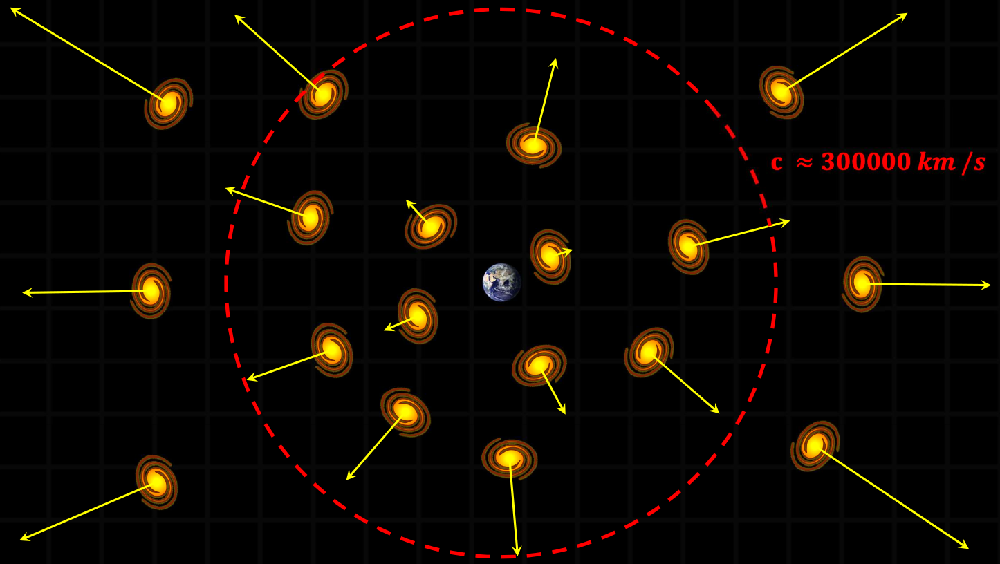
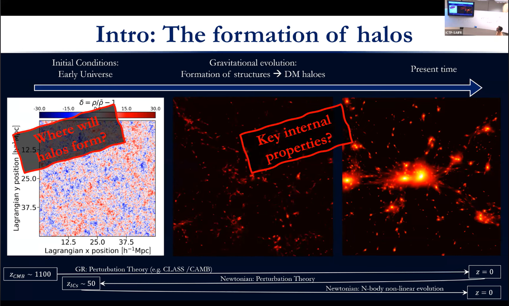
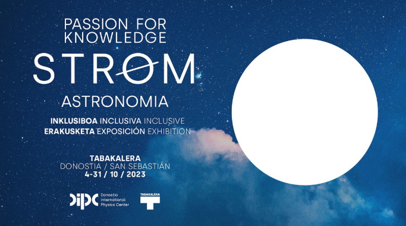
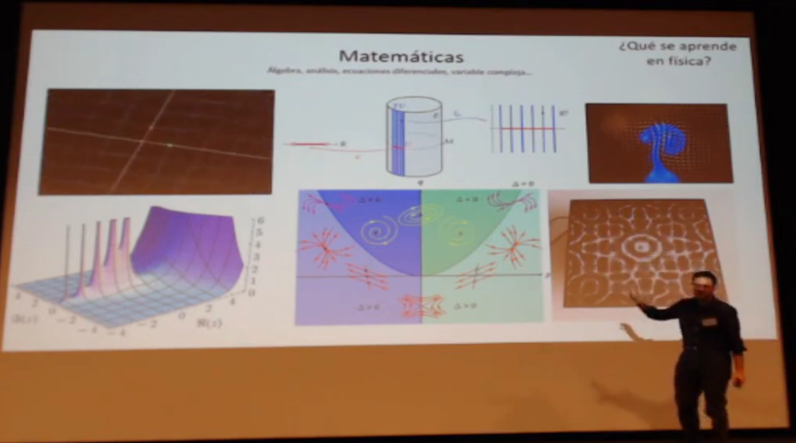
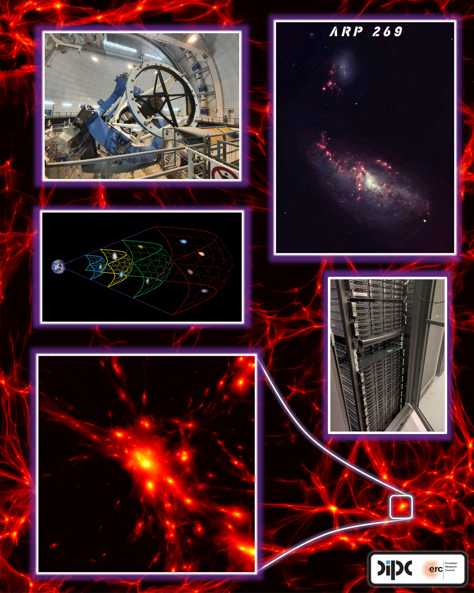
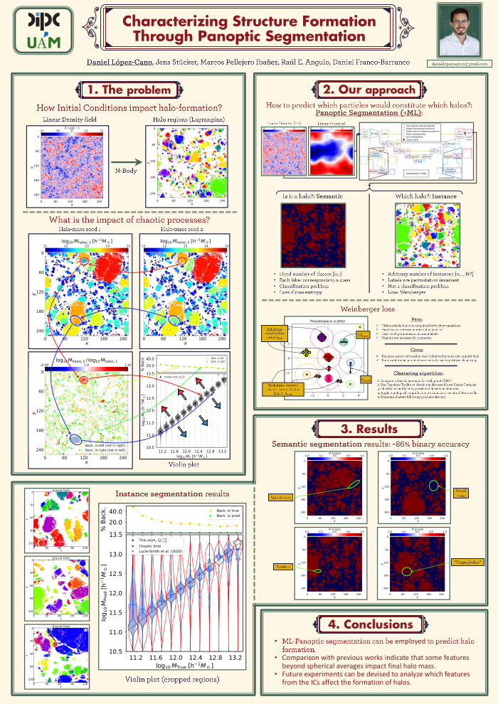
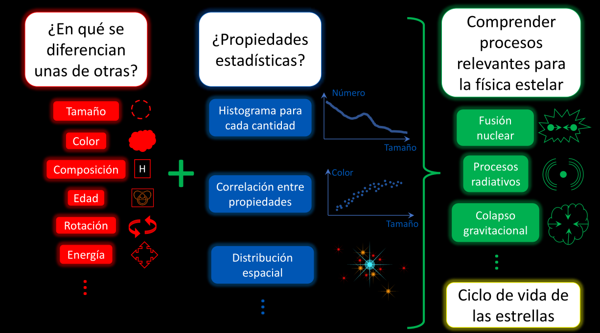

## Talks & Events

::: {.media-entry .media-entry-compact}
[{.media-thumb style="width: 145px; min-width: 145px;" fig-alt="Thumbnail for Las galaxias que vemos y que nunca alcanzaremos"}](https://www.youtube.com/watch?v=e7X5LF4FuOo&ab_channel=IkerketaZabalik)

::: {.media-body}
::: {.media-meta}
2022 · Outreach
:::

#### Scientific Monologue: *Las galaxias que vemos y que nunca alcanzaremos*
12/11/2022 · Zientzia Astea UPV/EHU, Spain

A public outreach talk on galaxies, cosmic scales, and the limits imposed by the expanding universe.

::: {.media-actions}
[YouTube](https://www.youtube.com/watch?v=e7X5LF4FuOo&ab_channel=IkerketaZabalik){.btn .btn-outline-info .btn-sm}
[Slides PDF](assets/files/slides/outreach/las_galaxias_que_vemos_y_que_nunca_alcanzaremos.pdf){.btn .btn-outline-info .btn-sm}
:::
:::
:::

::: {.media-entry .media-entry-compact}
[{.media-thumb style="width: 145px; min-width: 145px;" fig-alt="Thumbnail for Machine Learning Applications in Cosmology: Past, Present, and Future"}](https://www.youtube.com/watch?v=oZOMmPZpBAs)

::: {.media-body}
::: {.media-meta}
2024 · Talk
:::

#### Machine Learning Applications in Cosmology: Past, Present, and Future
08/11/2024 · IFT-UNESP / Instituto Principia, São Paulo, Brazil 

Public-facing video presentation introducing machine-learning applications in cosmology and their scientific impact.

::: {.media-actions}
[YouTube](https://www.youtube.com/watch?v=oZOMmPZpBAs){.btn .btn-outline-info .btn-sm}
:::
:::
:::

::: {.media-entry .media-entry-compact}
[{.media-thumb style="width: 145px; min-width: 145px;" fig-alt="Thumbnail for STROM inclusive astronomy exhibition"}](https://dipc.ehu.eus/es/ciencia-sociedad/passion-for-knowledge/x)

::: {.media-body}
::: {.media-meta}
2023 · Guide
:::

#### Astronomical Exhibition Guide: STROM – Inclusive Astronomy
04/10/2023–31/10/2023 · Tabakalera, Donostia / San Sebastián, Spain

Participation as an exhibition guide in an outreach initiative focused on inclusive astronomy.

::: {.media-actions}
[Project page](https://dipc.ehu.eus/es/ciencia-sociedad/passion-for-knowledge/x){.btn .btn-outline-info .btn-sm}
:::
:::
:::

::: {.media-entry .media-entry-compact}
[{.media-thumb style="width: 145px; min-width: 145px;" fig-alt="Thumbnail for Meet a Scientist"}](https://www.youtube.com/watch?v=kPnlDaMSb0U&ab_channel=Eureka%21ZientziaMuseoaDonostia-SanSebasti%C3%A1n)

::: {.media-body}
::: {.media-meta}
2024 · Outreach
:::

#### Meet a Scientist: “Encuentro de vidas científicas”
24/10/2024 · Eureka! Zientzia Museoa, Spain

Recurring public-engagement activity aimed at bringing scientific careers and research closer to high-school students.

::: {.media-actions}
[YouTube](https://www.youtube.com/watch?v=kPnlDaMSb0U&ab_channel=Eureka%21ZientziaMuseoaDonostia-SanSebasti%C3%A1n){.btn .btn-outline-info .btn-sm}
:::
:::
:::

## Posters

::: {.doc-grid .doc-grid-compact}
::: {.doc-card}
[{.doc-thumb .doc-thumb-compact fig-alt="Poster preview: Telescopes and detectors"}](assets/files/posters/poster_telescopes_and_detectors.pdf)

::: {.doc-body}
### Telescopes and Detectors

::: {.media-actions}
[Download PDF](assets/files/posters/poster_telescopes_and_detectors.pdf){.btn .btn-outline-info .btn-sm}
:::
:::
:::

::: {.doc-card}
[{.doc-thumb .doc-thumb-compact fig-alt="Poster preview: Computational cosmology"}](assets/files/posters/poster_computational_cosmology.pdf)

::: {.doc-body}
### Computational Cosmology

::: {.media-actions}
[Download PDF](assets/files/posters/poster_computational_cosmology.pdf){.btn .btn-outline-info .btn-sm}
:::
:::
:::

::: {.doc-card}
[{.doc-thumb .doc-thumb-compact fig-alt="Poster preview: Instance segmentation"}](assets/files/posters/poster_instance_segmentation.pdf)

::: {.doc-body}
### Instance Segmentation

::: {.media-actions}
[Download PDF](assets/files/posters/poster_instance_segmentation.pdf){.btn .btn-outline-info .btn-sm}
:::
:::
:::
:::

## Slides

::: {.slide-grid .slide-grid-compact}
::: {.slide-card}
[{.slide-thumb .slide-thumb-compact fig-alt="Slide preview: Bestiario Estelar"}](assets/files/slides/outreach/Bestiario_Estelar.pdf)

::: {.slide-body}
### Bestiario Estelar

Slides for the scientific monologue presented on **12/11/2022** at **Zientzia Club, Okendo Kultur Etxea, Spain**.

::: {.media-actions}
[Download PDF](assets/files/slides/outreach/Bestiario_Estelar.pdf){.btn .btn-outline-info .btn-sm}
:::
:::
:::

::: {.slide-card}
[{.slide-thumb .slide-thumb-compact fig-alt="Slide preview: Las galaxias que vemos y que nunca alcanzaremos"}](assets/files/slides/outreach/las_galaxias_que_vemos_y_que_nunca_alcanzaremos.pdf)

::: {.slide-body}
### Las galaxias que vemos y que nunca alcanzaremos

Slides for the scientific monologue presented on **12/11/2022** at **Zientzia Astea UPV/EHU, Spain**.

::: {.media-actions}
[Download PDF](assets/files/slides/outreach/las_galaxias_que_vemos_y_que_nunca_alcanzaremos.pdf){.btn .btn-outline-info .btn-sm}
:::
:::
:::
:::