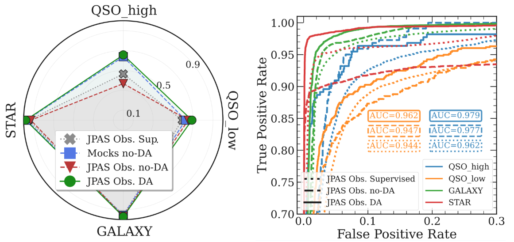
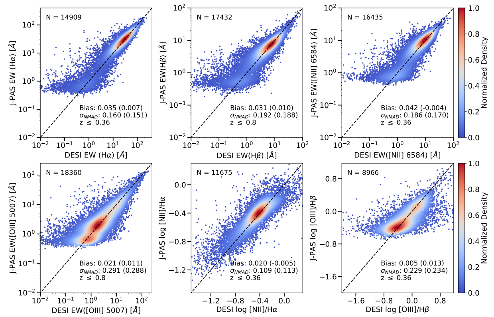
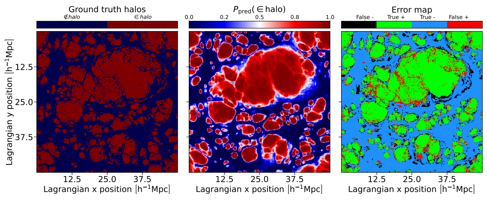
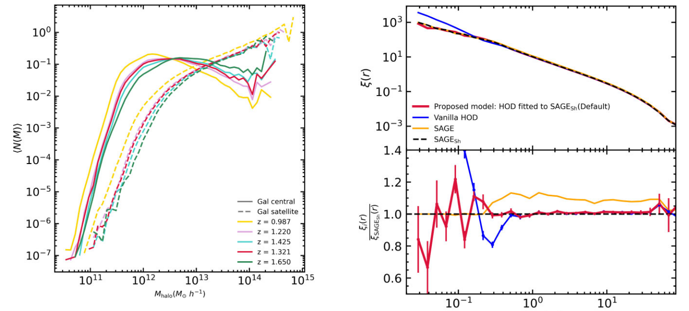
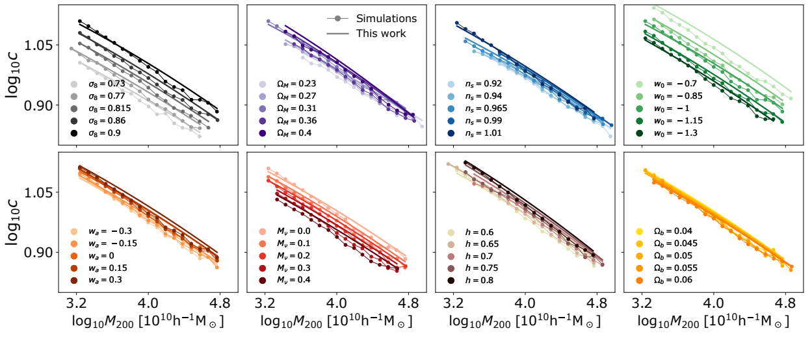
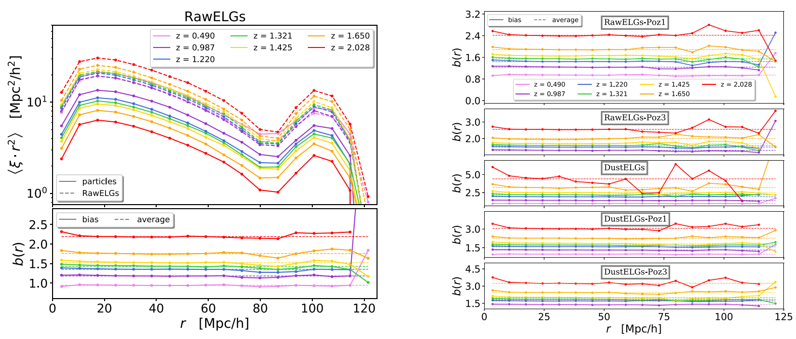

## Selected Publications

::: {.minimal-panel}
- **2026** — [*J-PAS: Semi-Supervised Sim-to-Obs Transfer for Robust Star–Galaxy–Quasar Classification*](https://arxiv.org/abs/2602.13902)  
  **Daniel López-Cano**, L. Raul Abramo, L. Nakazono, I. Pérez-Ràfols, et al.

- **2024** — [*Characterizing structure formation through instance segmentation*](https://www.aanda.org/articles/aa/full_html/2024/05/aa48965-23/aa48965-23.html)  
  **Daniel López-Cano**, Jens Stüker, Marcos Pellejero Ibáñez, Raúl E. Angulo, Daniel Franco-Barranco

- **2022** — [*The cosmology dependence of the concentration–mass–redshift relation*](https://academic.oup.com/mnras/article-abstract/517/2/2000/6731662)  
  **Daniel López-Cano**, Raúl E. Angulo, Aaron D. Ludlow, M. Zennaro, S. Contreras, Jonás Chaves-Montero, G. Aricò
:::

## Full Publication List

::: {.media-entry}
::: {.media-body}
::: {.media-meta}
2026 · First author
:::

### J-PAS: Semi-Supervised Sim-to-Obs Transfer for Robust Star–Galaxy–Quasar Classification

**Daniel López-Cano**, L. Raul Abramo, L. Nakazono, I. Pérez-Ràfols, et al.  
*arXiv preprint, arXiv:2602.13902, doi:10.48550/arXiv.2602.13902*

Semi-supervised domain adaptation for robust star–galaxy–quasar classification, designed to transfer effectively from simulated to observational data in the J-PAS setting.

{.money-plot fig-alt="Representative figure from the J-PAS paper"}

::: {.media-actions}
[arXiv](https://arxiv.org/abs/2602.13902){.btn .btn-outline-info .btn-sm}
[GitHub repository](https://github.com/daniellopezcano/JPAS_Domain_Adaptation/tree/main){.btn .btn-outline-info .btn-sm}
[Google Slides](https://docs.google.com/presentation/d/1hwGBFQcXHGn94TY0dI_yhGfEP5Hio0FlPVSDhUs2MT4/edit?usp=drive_link){.btn .btn-outline-info .btn-sm}
[Slides PDF](assets/files/projects/domain_adaptation_for_sim_to_obs_astrophysics.pdf){.btn .btn-outline-info .btn-sm}
:::
:::
:::

::: {.media-entry}
::: {.media-body}
::: {.media-meta}
2026 · Collaboration
:::

### OJALÁ: Optimizing J-PAS Astronomy for Large-scale Analysis. A foundation model for the SED of galaxies, QSOs and stars

G. Martínez-Solaeche, R. M. González Delgado, R. García-Benito, …, **D. López-Cano**, et al.  
*arXiv preprint, arXiv:2604.00661, doi:10.48550/arXiv.2604.00661*

A collaboration paper developing a foundation-model approach for spectral energy distributions of galaxies, QSOs, and stars in the J-PAS context.

{.money-plot fig-alt="Representative figure from the OJALÁ paper"}

::: {.media-actions}
[arXiv](https://arxiv.org/abs/2604.00661){.btn .btn-outline-info .btn-sm}
:::
:::
:::

::: {.media-entry}
::: {.media-body}
::: {.media-meta}
2024 · First author
:::

### Characterizing structure formation through instance segmentation

**Daniel López-Cano**, Jens Stüker, Marcos Pellejero Ibáñez, Raúl E. Angulo, Daniel Franco-Barranco  
*Astronomy & Astrophysics, 685, A37*

This work explores structure formation in cosmological simulations through instance segmentation, connecting modern computer-vision techniques with questions in numerical cosmology.

{.money-plot fig-alt="Representative figure from the instance segmentation paper"}

::: {.media-actions}
[Journal](https://www.aanda.org/articles/aa/full_html/2024/05/aa48965-23/aa48965-23.html){.btn .btn-outline-info .btn-sm}
[GitHub repository](https://github.com/daniellopezcano/instance_halos){.btn .btn-outline-info .btn-sm}
[Google Slides](https://docs.google.com/presentation/d/13nAvXvbbYCtREY7CNASzztdn60vl3elDYdsg3zHQ6xY/edit?usp=sharing){.btn .btn-outline-info .btn-sm}
[Slides PDF](assets/files/projects/instance_segmentation.pdf){.btn .btn-outline-info .btn-sm}
:::
:::
:::

::: {.media-entry}
::: {.media-body}
::: {.media-meta}
2024 · Co-author
:::

### An improved halo occupation distribution prescription from UNITsim Hα emission-line galaxies: conformity and modified radial profile

Guillermo Reyes-Peraza, Santiago Avila, Violeta Gonzalez-Perez, **Daniel López-Cano**, Alexander Knebe, Sujatha Ramakrishnan, Gustavo Yepes  
*Monthly Notices of the Royal Astronomical Society, 529, 3877–3893*

A study of improved halo-occupation prescriptions for Hα emission-line galaxies, with attention to conformity and modified radial profiles.

{.money-plot fig-alt="Representative figure from the HOD H-alpha paper"}

::: {.media-actions}
[Journal](https://academic.oup.com/mnras/article/529/4/3877/7623782){.btn .btn-outline-info .btn-sm}
:::
:::
:::

::: {.media-entry}
::: {.media-body}
::: {.media-meta}
2022 · First author
:::

### The cosmology dependence of the concentration–mass–redshift relation

**Daniel López-Cano**, Raúl E. Angulo, Aaron D. Ludlow, M. Zennaro, S. Contreras, Jonás Chaves-Montero, G. Aricò  
*Monthly Notices of the Royal Astronomical Society, 517, 2000–2011*

A study of how halo concentrations vary across cosmologies, masses, and redshifts, contributing to the theoretical characterization of halo structure.

{.money-plot fig-alt="Representative figure from the concentration-mass-redshift paper"}

::: {.media-actions}
[Journal](https://academic.oup.com/mnras/article-abstract/517/2/2000/6731662){.btn .btn-outline-info .btn-sm}
[Google Slides](https://docs.google.com/presentation/d/13XB2L3M5UgkVJdepnk7QrlBSWFZ7wmOaRnUqaFB_9ak/edit?usp=sharing){.btn .btn-outline-info .btn-sm}
[Slides PDF](assets/files/publications/concentration_mass_redshift_cosmology_relation.pdf){.btn .btn-outline-info .btn-sm}
:::
:::
:::

::: {.media-entry}
::: {.media-body}
::: {.media-meta}
2022 · Second author
:::

### UNITSIM-Galaxies: data release and clustering of emission-line galaxies

Alexander Knebe, **Daniel López-Cano**, Santiago Avila, Ginevra Favole, Adam R. H. Stevens, Violeta Gonzalez-Perez, Guillermo Reyes-Peraza, Gustavo Yepes, Chia-Hsun Chuang, Francisco-Shu Kitaura  
*Monthly Notices of the Royal Astronomical Society, 510, 5392–5407*

A data-release and clustering analysis paper for emission-line galaxies in the UNITsim-Galaxies framework.

{.money-plot fig-alt="Representative figure from the UNITSIM-Galaxies paper"}

::: {.media-actions}
[Journal](https://academic.oup.com/mnras/article/510/4/5392/6505155){.btn .btn-outline-info .btn-sm}
:::
:::
:::