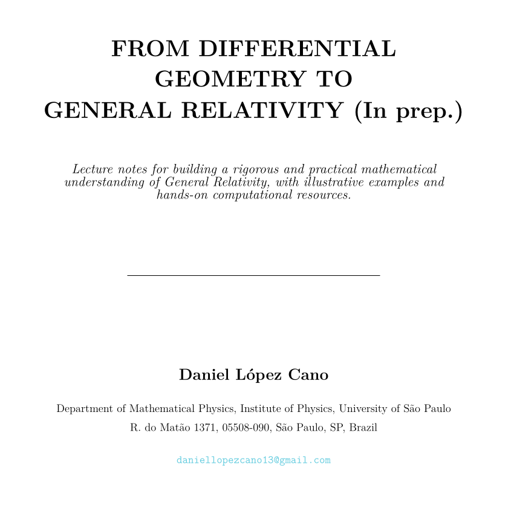
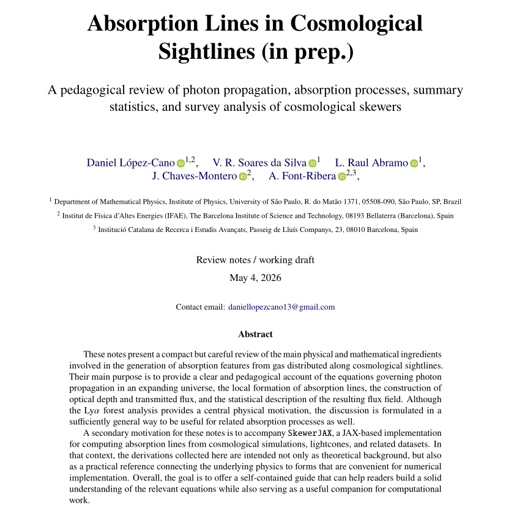
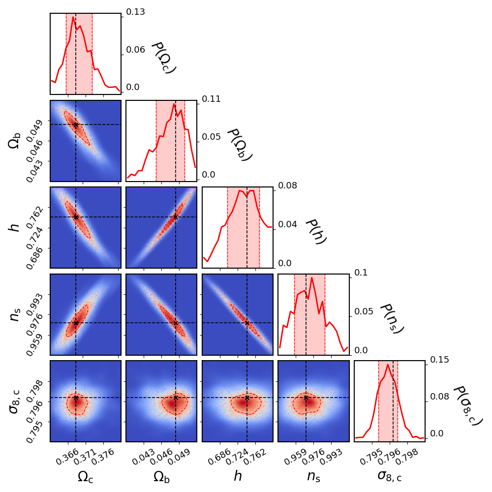
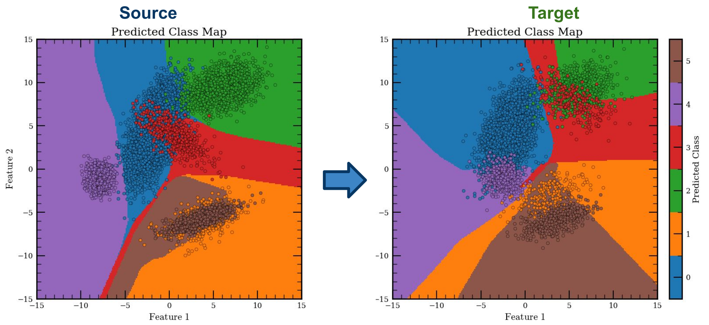
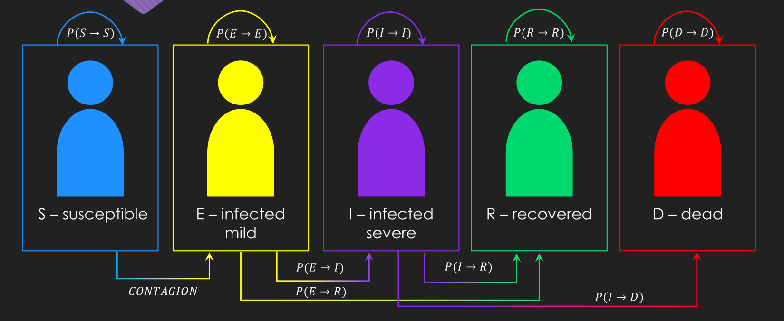
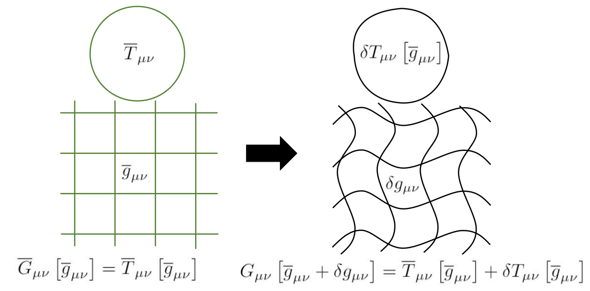

## Lecture Notes

::: {.doc-grid .doc-grid-compact}

::: {.doc-card}
[{.doc-thumb .doc-thumb-compact fig-alt="Preview of From Differential Geometry to General Relativity"}](assets/files/docs/from_differential_geometry_to_general_relativity.pdf)

::: {.doc-body}
### From Differential Geometry to General Relativity

Graduate-level notes with formal derivations, worked examples, visual intuition, and Python-based supporting material.

::: {.media-actions}
[Download PDF](assets/files/docs/from_differential_geometry_to_general_relativity.pdf){.btn .btn-outline-info .btn-sm}
[GitHub](https://github.com/daniellopezcano/differential_geometry){.btn .btn-outline-info .btn-sm}
:::
:::
:::

::: {.doc-card}
[{.doc-thumb .doc-thumb-compact fig-alt="Preview of Absorption Lines in Cosmological Sightlines"}](assets/files/docs/absorption_lines_in_cosmological_sightlines.pdf)

::: {.doc-body}
### Notes on Ly$\alpha$ Forest and Absorption Processes in Cosmology

Pedagogical notes on Ly$\alpha$ skewer generation, optical depth, transmitted flux, velocity-space mappings, and metal-line modelling.

::: {.media-actions}
[Download PDF](assets/files/docs/absorption_lines_in_cosmological_sightlines.pdf){.btn .btn-outline-info .btn-sm}
[GitHub](https://github.com/daniellopezcano/SkewerJAX){.btn .btn-outline-info .btn-sm}
:::
:::
:::

:::

## Other Projects & Open Source Software

::: {.project-grid}

::: {.project-card}
[{.project-card-thumb fig-alt="Thumbnail for SBI and BACCO workflows"}](https://github.com/daniellopezcano/SBI-baccoemu/tree/main)

::: {.project-card-body}
::: {.media-meta}
Inference · emulation · numerical cosmology
:::

### Simulation-Based Inference and Emulation Workflows

Simulation-based inference workflows built around emulated power spectra from `baccoemu`, with notebooks and analysis code for numerical-cosmology applications.

::: {.media-actions}
[GitHub](https://github.com/daniellopezcano/SBI-baccoemu/tree/main){.btn .btn-outline-info .btn-sm}
[BACCO](https://bacco.dipc.org/index.html){.btn .btn-outline-info .btn-sm}
[Slides](https://docs.google.com/presentation/d/1vQhXZipVcYLyRwnM6juNGSE5zor7rbg0Dnh6oNUBW_k/edit?usp=sharing){.btn .btn-outline-info .btn-sm}
[PDF](assets/files/projects/towards_robust_inference_in_the_presence_of_model_misspecification.pdf){.btn .btn-outline-info .btn-sm}
:::
:::
:::

::: {.project-card}
[{.project-card-thumb fig-alt="Thumbnail for Domain Adaptation"}](https://github.com/daniellopezcano/JPAS_Domain_Adaptation/tree/main)

::: {.project-card-body}
::: {.media-meta}
Machine learning · contrastive learning · survey classification
:::

### Contrastive Learning & Domain Adaptation

Compact set of contrastive-learning and sim-to-obs adaptation experiments, including the J-PAS domain-adaptation pipeline and related inference/configuration repos.

::: {.media-actions}
[CL mini](https://github.com/daniellopezcano/CL_mini){.btn .btn-outline-info .btn-sm}
[CL inference](https://github.com/daniellopezcano/CL_inference){.btn .btn-outline-info .btn-sm}
[JPAS DA](https://github.com/daniellopezcano/JPAS_Domain_Adaptation/tree/main){.btn .btn-outline-info .btn-sm}
:::
:::
:::

::: {.project-card}
[{.project-card-thumb fig-alt="Thumbnail for infectious disease model"}](https://github.com/daniellopezcano/infectious_disease_model/tree/main)

::: {.project-card-body}
::: {.media-meta}
Modelling · simulation · scientific computing
:::

### Infectious Disease Model

Small modelling project on infectious-disease dynamics, centered on simulation-based exploration and supporting presentation material.

::: {.media-actions}
[GitHub](https://github.com/daniellopezcano/infectious_disease_model/tree/main){.btn .btn-outline-info .btn-sm}
[PDF](assets/files/projects/infectious_disease_model.pdf){.btn .btn-outline-info .btn-sm}
:::
:::
:::

:::

## Slides

::: {.slide-grid .slide-grid-compact}

::: {.slide-card}
[{.slide-thumb .slide-thumb-compact fig-alt="Preview of cosmological perturbation theory slides"}](assets/files/slides/projects/cosmo_perturbation_theory.pdf)

::: {.slide-body}
### Cosmological Perturbation Theory

Compact teaching slide deck for lecture or tutorial use.

::: {.media-actions}
[Download PDF](assets/files/slides/projects/cosmo_perturbation_theory.pdf){.btn .btn-outline-info .btn-sm}
:::
:::
:::

:::