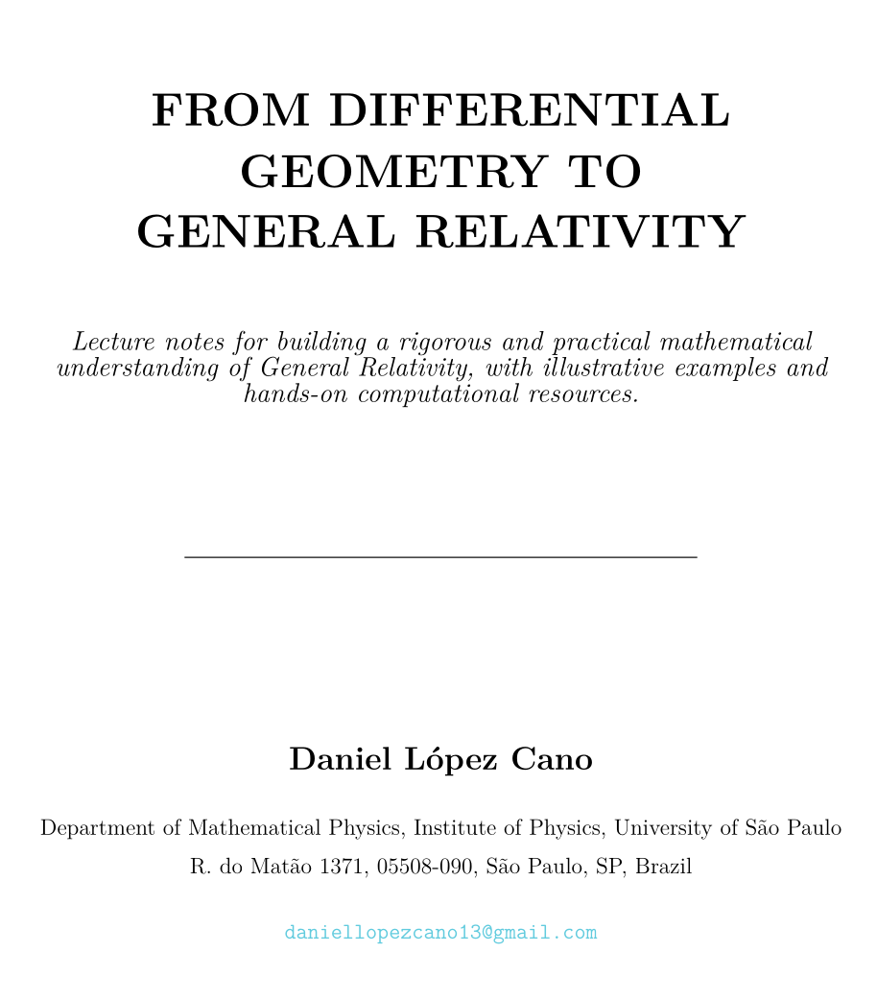
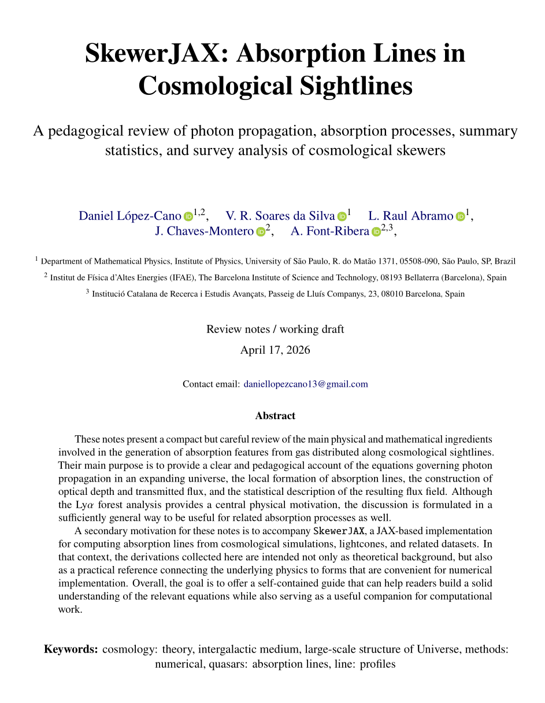

## Lecture Notes

::: {.doc-grid}
::: {.doc-card}
[{.doc-thumb fig-alt="Preview of differential geometry notes"}](https://github.com/daniellopezcano/lecture_notes/blob/main/from_diff_geom_to_num_cosmo/main.pdf)

::: {.doc-body}
### From Differential Geometry to General Relativity

Graduate-level lecture notes combining formal derivations, worked examples, visual intuition, and accompanying Python-based resources.

::: {.media-actions}
[Lecture Notes PDF](https://github.com/daniellopezcano/lecture_notes/blob/main/from_diff_geom_to_num_cosmo/main.pdf){.btn .btn-outline-info .btn-sm}
[GitHub repository](https://github.com/daniellopezcano/differential_geometry){.btn .btn-outline-info .btn-sm}
:::
:::
:::

::: {.doc-card}
[{.doc-thumb fig-alt="Preview of Ly-alpha notes"}](https://github.com/daniellopezcano/SkewerJAX_Review_and_Equations)

::: {.doc-body}
### Notes on Ly$\alpha$ Forest and Absorption Processes in Cosmology

Pedagogical material on Ly$\alpha$ skewer generation, optical depth, transmitted flux, velocity-space mappings, and metal-line modelling, together with code and derivations.

::: {.media-actions}
[Lecture Notes PDF](https://github.com/daniellopezcano/SkewerJAX_Review_and_Equations){.btn .btn-outline-info .btn-sm}
[GitHub repository](https://github.com/daniellopezcano/SkewerJAX){.btn .btn-outline-info .btn-sm}
:::
:::
:::
:::

## Slides

::: {.slide-grid}
::: {.slide-card}
[{.slide-thumb fig-alt="Preview of cosmological perturbation theory slides"}](assets/files/slides/projects/cosmo_perturbation_theory.pdf)

::: {.slide-body}
### Cosmological Perturbation Theory

Slide presentation for teaching or didactic use.

::: {.media-actions}
[Download PDF](assets/files/slides/projects/cosmo_perturbation_theory.pdf){.btn .btn-outline-info .btn-sm}
:::
:::
:::
:::

## Other Projects & Open Source Software

::: {.media-entry}
[{.media-thumb .project-thumb fig-alt="Thumbnail for SBI and BACCO workflows"}](https://github.com/daniellopezcano/SBI-baccoemu/tree/main)

::: {.media-body}
::: {.media-meta}
Inference · emulation · numerical cosmology
:::

### Simulation-Based Inference and Emulation Workflows

Tools and experiments related to emulator-assisted inference and numerical cosmology pipelines, including work connected to BACCO-style workflows and ML-assisted cosmological analyses.

::: {.media-actions}
[GitHub repository](https://github.com/daniellopezcano/SBI-baccoemu/tree/main){.btn .btn-outline-info .btn-sm}
[BACCO project](https://bacco.dipc.org/index.html){.btn .btn-outline-info .btn-sm}
[Google Slides](https://docs.google.com/presentation/d/1vQhXZipVcYLyRwnM6juNGSE5zor7rbg0Dnh6oNUBW_k/edit?usp=sharing){.btn .btn-outline-info .btn-sm}
[Slides PDF](assets/files/projects/towards_robust_inference_in_the_presence_of_model_misspecification.pdf){.btn .btn-outline-info .btn-sm}
:::
:::
:::

::: {.media-entry}
[{.media-thumb .project-thumb fig-alt="Thumbnail for Domain Adaptation"}](https://github.com/daniellopezcano/JPAS_Domain_Adaptation/tree/main)

::: {.media-body}
::: {.media-meta}
Machine learning · survey classification
:::

### Contrastive Learning & Domain Adaptation

This needs to be elaborated based on the contents of the associatted repos.

::: {.media-actions}
[GitHub repository](https://github.com/daniellopezcano/CL_mini){.btn .btn-outline-info .btn-sm}
[GitHub repository](https://github.com/daniellopezcano/CL_inference){.btn .btn-outline-info .btn-sm}
[GitHub repository](https://github.com/daniellopezcano/JPAS_Domain_Adaptation/tree/main){.btn .btn-outline-info .btn-sm}
:::
:::
:::

::: {.media-entry}
[{.media-thumb .project-thumb fig-alt="Thumbnail for infectious disease model"}](https://github.com/daniellopezcano/infectious_disease_model/tree/main)

::: {.media-body}
::: {.media-meta}
Modelling · simulation · scientific computing
:::

### Infectious Disease Model

A modelling project focused on infectious-disease dynamics, combining scientific computation, mathematical modelling, and reproducible workflows.

::: {.media-actions}
[GitHub repository](https://github.com/daniellopezcano/infectious_disease_model/tree/main){.btn .btn-outline-info .btn-sm}
[PDF material](assets/files/projects/infectious_disease_model.pdf){.btn .btn-outline-info .btn-sm}
:::
:::
:::